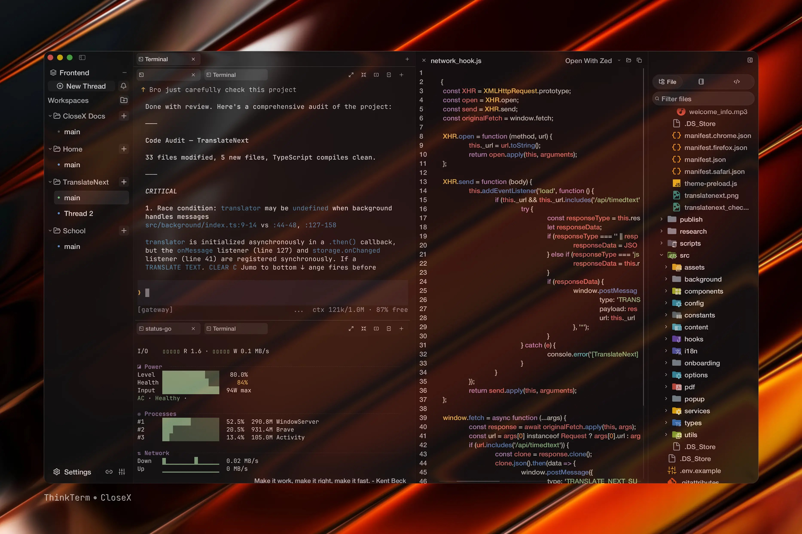
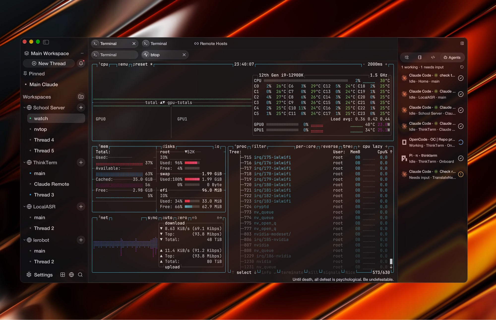
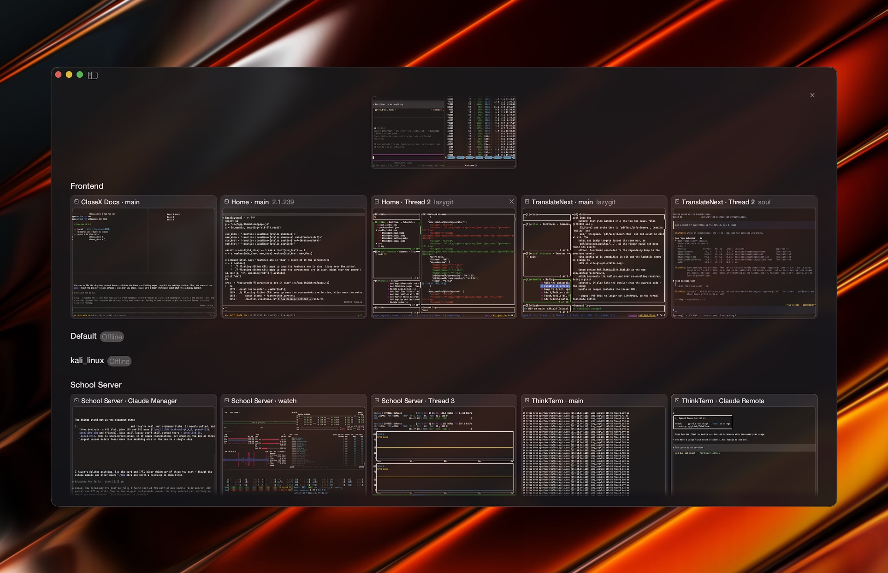
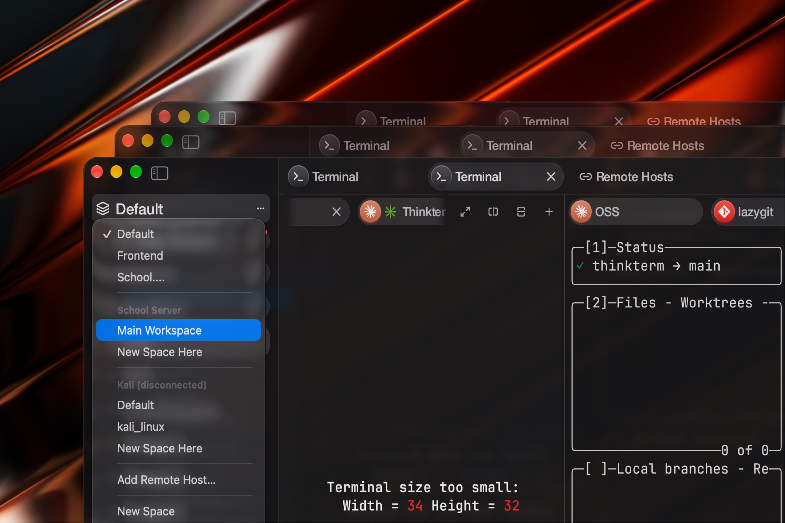

# ThinkTerm

[English](README.md) · [简体中文](README.zh-CN.md) · **日本語** · [Français](README.fr-FR.md) · [Deutsch](README.de-DE.md)

## 📥 ダウンロード

**[こちらからダウンロード](https://github.com/RoversX/ThinkTerm/releases)** - 最新リリースを入手

🌐 **公式サイト**: [closex.org/thinkterm](https://closex.org/thinkterm/)

📚 **ドキュメント**: [docs.closex.org/thinkterm](https://docs.closex.org/thinkterm/)

**複数のマシンを、ひとつの作業環境に。**

ThinkTerm は [WezTerm](https://github.com/wezterm/wezterm) を基盤とした、**Rust で書かれた、マルチプレクサー内蔵のオープンソースターミナル**です。mux サーバーがシェル、ツール、コーディングエージェントを実行し、デスクトップ、TUI、ブラウザーの各クライアントがそのセッションに接続します。ローカルとリモートの作業を同じワークスペースにまとめ、別のデバイスからも接続できます。

**対応プラットフォーム：** macOS · Linux · Windows · Web · TUI — iOS と Android は開発中。

<table>
  <tr>
    <td width="50%" align="center">
      
      <br><strong>プロジェクトのワークスペース</strong>
    </td>
    <td width="50%" align="center">
      
      <br><strong>複数マシンのエージェント</strong>
    </td>
  </tr>
  <tr>
    <td width="50%" align="center">
      
      <br><strong>セッションの全体表示</strong>
    </td>
    <td width="50%" align="center">
      
      <br><strong>スペースの切り替え</strong>
    </td>
  </tr>
</table>

## 中心にあるのはマルチプレクサー

ターミナルマルチプレクサーは複数のターミナルセッションを管理し、クライアントからの接続を受け付けます。ThinkTerm では、**mux サーバーがセッション、タブ、分割ペインを保持**し、クライアントが表示と入力の送信を担当します。

- **切断しても作業を継続。** クライアントを切断しても、サーバー上のセッションは動き続けます。再接続すれば、同じシェル、ビルド、エージェントのタスクに戻れます。ペインを明示的に閉じる操作は別です。
- **異なるクライアントから同じセッションへ。** デスクトップ、`thinkterm tui`、ブラウザーからサーバーに接続できます。複数のクライアントを同時に接続し、それぞれのインターフェースで共有セッションを操作できます。
- **複数のマシンで作業。** 各ホストが独自の mux サーバーを実行します。ThinkTerm Connect はリモートのワークスペースをローカルの作業と同じデスクトップに表示し、サイドバーからマシンを切り替えられるようにします。プロセスは元のホスト上で動作し続けます。

セッションが動き続けるには、mux サーバーとそのホストが利用可能である必要があります。サーバーやホストの再起動後に、実行中だったプロセスを復元する機能ではありません。

## ThinkTerm を作った理由

複数のプロジェクトでエージェントを同時に動かしていると、タブだけでは状況がわからなくなります。どのセッションが処理中で、どれが入力待ちなのか。さっきのビルドはどこで終わったのか。ThinkTerm はプロジェクト構造と作業状態をターミナルの横に表示し、ローカルとリモートの作業をまとめて把握できるようにします。

ThinkTerm のターミナルコア、mux サーバー、デスクトップクライアント、TUI は Rust で実装されています。デスクトップ版は GPU で描画し、Electron や埋め込み WebView を使用しません。WezTerm のネイティブな基盤に、ワークスペース管理、永続的なリモートセッション、エージェントと作業するためのツールを追加しています。

## 作業に合わせたワークスペース

| 階層 | 役割 |
| --- | --- |
| **Space（スペース）** | ローカル作業、リモート mux 接続、ノートの Vault などの作業環境。 |
| **Project（プロジェクト）** | その環境に属するプロジェクトディレクトリ。 |
| **Thread（スレッド）** | タブと分割ペインを持つセッション。ピン留めや未読設定が可能。 |

ローカルとリモートのワークスペースを同じサイドバーに表示します。Thread の状態で、処理中、対応が必要、完了、待機中を区別できます。全体表示では Space ごとにターミナルのライブプレビューが並ぶため、タブをひとつずつ開かずにセッションを探せます。

## 日々のターミナル作業に

- **Rust、性能、メモリ効率。** ThinkTerm は負荷の高いターミナル作業を想定しています。多数のセッションやエージェントを並行して動かしても快適に操作できることを目指し、ターミナルの処理性能、描画効率、メモリ使用量を継続的に最適化しています。
- **エージェントの状態。** Agents パネルは、認識したコーディングエージェントの作業状態と所属プロジェクトを一覧表示します。エージェント検出とパネルは設定で無効にできます。
- **リモートセッション。** SSH、Mosh、または ThinkTerm Connect による永続的な mux セッションを選べます。リモート mux セッションではタブ、ペイン分割、サイズ変更、再接続が可能です。予測ローカルエコーは、遅延の大きい接続で入力の体感遅延を軽減できます。
- **ターミナルの横にファイルを表示。** プロジェクトのファイルを参照し、構文強調表示付きでソースをプレビューしたり、外部エディターで開いたりできます。リモートファイルには SFTP でアクセスし、アップロード、ダウンロード、ドラッグ＆ドロップによる転送に対応します。
- **ノート。** Obsidian と互換性のある Vault で Markdown を編集できます。表、コードブロック、自動保存に対応し、ファイルは選択したディレクトリに通常の Markdown として保存されます。
- **スニペットとプラグイン。** Snippets を内蔵しています。プラグインはデスクトップ版とブラウザー版のサイドバーにパネルを追加できます。このリポジトリには、隣のターミナルが使う Git リポジトリの変更を確認する [Diff プラグイン](plugins/diff)も含まれています。[ThinkTerm SDK](docs/thinkterm/plugins.md#rust-sdk) を使って、Rust で独自のプラグインを開発できます。ほかの人が公開しているプラグインは、GitHub のトピック [`thinkterm-plugin`](https://github.com/topics/thinkterm-plugin) で探せます。導入と開発については[プラグインガイド](docs/thinkterm/plugins.md)をご覧ください。
- **充実したターミナルコア。** リガチャ、カラー絵文字、トゥルーカラー、ハイパーリンク、インライン画像、コピーモード、シェル統合を WezTerm から継承しています。 その他のターミナル機能については [WezTerm の機能ガイド](https://wezterm.org/features.html)をご覧ください。
- **ネイティブのデスクトップ設定。** テーマ、UI の文字サイズ、ターミナルのオプション、描画方式を調整できます。メインウィンドウと設定ウィンドウの両方が WebGPU と OpenGL に対応し、WebGPU の初期化に失敗すると OpenGL にフォールバックします。
- **5 つの表示言語。** English、简体中文、日本語、Français、Deutsch。

CLI からペインを自動操作することもできます。`thinkterm cli send-text` は入力を送り、`thinkterm cli get-text` はターミナル出力を読み取ります。エージェントはこれらのコマンドを使ってターミナル経由で連携できます。[連携に関する文書](docs/thinkterm/agent-collaboration.md)では、実演済みのワークフローと、ターミナル入力をメッセージ伝達に使う場合の限界を説明しています。

## 接続方法を選ぶ

| クライアント | 現在の範囲 |
| --- | --- |
| **デスクトップ** | macOS、Linux、Windows 向けのネイティブアプリ。 |
| **TUI** | `thinkterm tui` を使い、既存のターミナル内でワークスペースを移動し、セッションを操作。 |
| **ブラウザー** | 自分の mux サーバーが配信するクライアント。WebGPU とブラウザーのセキュアコンテキストが必要。アクセスを明示的に有効化する必要あり。 |
| **iOS と Android** | 開発中のネイティブクライアント。Rust コアを共有し、GPU 描画と SSH 通信を使用。リリースに向けた整備と実機検証は継続中。 |

各クライアントはサーバー上のセッションに接続しますが、インターフェースや対応機能は異なります。

### ターミナルインターフェース

```sh
thinkterm tui
thinkterm tui --help
```

TUI はワークスペースの移動、タブ、ペイン分割、サイズ変更、コピーモード、マウス操作に対応しています。終了時には接続を解除するだけで、サーバー上のセッションは閉じません。別のターミナルから実行してください。ThinkTerm 自身のセッション内で起動すると、入れ子のセッションを防ぐ保護機能が働く場合があります。

### ブラウザーからのアクセス

**Settings → Web（設定 → Web）** でリスナーを有効にし、ブラウザー用のアクセストークンを作成します。mux サーバーがクライアントとそのリソースを配信します。ループバック以外の接続では、既定で HTTPS が必要です。WebGPU を利用するためにも、ブラウザーのセキュアコンテキストが必要です。

リスナー、トークン、SSH 転送、証明書については[ブラウザーからのアクセス](docs/thinkterm/web-access.md)をご覧ください。

### モバイル版の開発

[iOS](ios) と [Android](android) のアプリは、ネイティブ UI と共有の[モバイルコア](thinkterm-mobile)を使用します。SSH で別のマシン上のセッションに接続します。現在も開発中であり、リリース済みのモバイル製品としては案内していません。

## 使い始める

macOS または Linux でデスクトップ版をビルドするには、Rust とプラットフォームのビルドツールをインストールし、次を実行します。

```sh
git clone --recursive https://github.com/RoversX/ThinkTerm.git
cd ThinkTerm
./get-deps
cargo build --release -p wezterm -p wezterm-gui -p wezterm-mux-server -p thinkterm-plugin-server
```

実行ファイルは `target/release` に生成されます。ソース構成と開発手順は[貢献ガイド](CONTRIBUTING.md)をご覧ください。[ブラウザー用ビルドスクリプト](ci/build-web.sh)で Web リソースを別途ビルドします。モバイル版のビルドには [ios/build.sh](ios/build.sh) と [android/build.sh](android/build.sh)を使用します。

実行ファイルを `PATH` に追加したら、次のコマンドを使えます。

```sh
thinkterm start              # デスクトップアプリを起動
thinkterm tui                # ターミナルインターフェースを起動
thinkterm connect <name>     # 設定済みの mux ドメインに接続
thinkterm cli --help         # mux セッションの確認と操作
thinkterm plugin list        # 利用可能なプラグインを一覧表示
thinkterm --help             # すべてのコマンドを表示
```

## ドキュメントと開発

- [ブラウザーからのアクセス](docs/thinkterm/web-access.md)
- [プラグイン](docs/thinkterm/plugins.md)
- [開発への参加](CONTRIBUTING.md)

## 設定とプライバシー

ThinkTerm は Lua で設定し、既定では ThinkTerm 独自のパスを使用します。多くの WezTerm オプションに対応しています。**Settings → Compatibility（設定 → 互換性）** では、既存の WezTerm 設定から選択した項目を取り込めます。`THINKTERM_CONFIG_FILE` や互換用の `WEZTERM_CONFIG_FILE` など、明示的なファイル指定で別のファイルを選ぶこともできます。

### ThinkTerm はテレメトリーやトラッカーを一切使用しません

`check_for_updates = false` で更新確認を無効にできます。リモート接続やノート内の画像読み込みなどは、利用時にネットワーク通信を行います。ノートのリモート画像は `note_remote_images_enabled = false` で無効にできます。

デスクトップ版の SSH ホスト一覧は、ローカルに保存した鍵でパスワードを暗号化します。バックアップを含め、鍵と暗号化されたホストデータの両方を持つ人はパスワードを復号できます。ブラウザーのアクセストークンはサーバー上のターミナルセッションへのアクセスを許可するため、認証情報として管理してください。

プライバシーポリシーとブラウザーデータの扱いについては [PRIVACY.md](PRIVACY.md)をご覧ください。

## 謝辞

- **[@wez](https://github.com/wez/) と [WezTerm](https://github.com/wezterm/wezterm) の貢献者の皆さん**に感謝します。ターミナルエミュレーション、フォントと GPU の描画、SSH 対応を含むターミナルコアとマルチプレクサーの基盤が、ThinkTerm を支えています。
- ThinkTerm が使用するエージェント検出マニフェストを提供してくださった **[herdr](https://github.com/herdrdev/herdr) の貢献者の皆さん**に感謝します。
- アイコン素材を提供する **Lucide、Simple Icons、Lobe Icons、material-icon-theme** に感謝します。
- **ThinkTerm** のコード、翻訳、テスト、不具合報告、フィードバックに協力してくださるすべての皆さんに感謝します。

貢献を歓迎します。プルリクエストを作成する前に [CONTRIBUTING.md](CONTRIBUTING.md) をお読みください。

## ライセンス

ThinkTerm のライセンスは **GPL-3.0-only** です。[LICENSE.md](LICENSE.md)をご覧ください。WezTerm 由来のコードは元の MIT ライセンスを維持し、[LICENSE-MIT](LICENSE-MIT)に記載しています。herdr 由来のエージェント検出マニフェストは **Apache-2.0** ライセンスです。

第三者のコンポーネントと同梱リソースの完全なクレジットおよびライセンスは、[NOTICE](NOTICE) と [licenses/README.md](licenses/README.md)をご覧ください。
